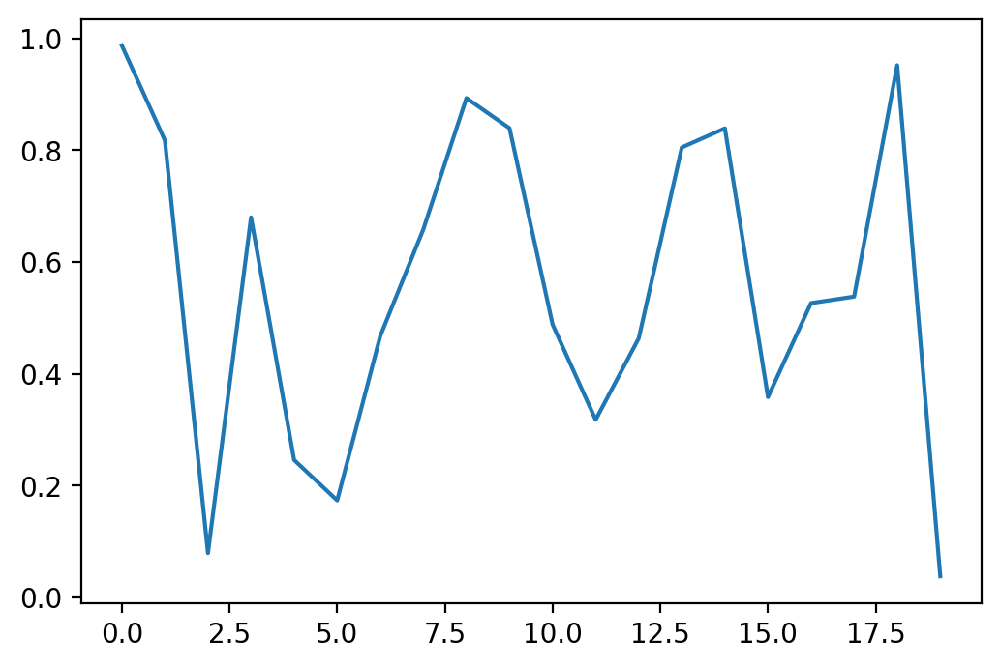

---
jupyter:
  jupytext:
    formats: notebooks//ipynb,rmd//Rmd
    text_representation:
      extension: .Rmd
      format_name: rmarkdown
      format_version: '1.2'
      jupytext_version: 1.4.2
  kernelspec:
    display_name: Python 3
    language: python
    name: python3
---

# Use RMarkdown...


...when you want to weave together code (it doesn't have to be R!), and narrative (efficiently written in Markdown).


## With Python


Let's demonstrate with the classic entrypoint to Python:


```python
print('hello world')
```

```
hello world
```


And now we'll do something a tiny bit more complicated: use numpy to generate an array of twenty random numbers, which we'll then use matplotlit to plot.


```python
import numpy as np
import matplotlib.pyplot as plt
```


```python
numbers = np.random.rand(20,1)
```


```python
plt.plot(numbers)
plt.show()
```

\


Now let's add a citation (I'm using Zotero, with the BetterBibTex plugin, and citation keys in the format `[authForeIni][authEtAl][year]`, and then exporting the bibliography as `refs.bib`, which needs to be saved in our `bits` folder) -- maybe something about Jupyter notebooks [@TKluyverEtAl2016] -- and we can run our bash script to turn this into a publishable PDF...


```python
# to run this from within the notebook, first comment out this line and save...
# ...and then uncomment the line to run it -- otherwise, Pweave will get stuck...
# ...in an infinite loop and be unable to finish processing the notebook
# ! ../bits/publi.sh RMarkdown
```


## References
